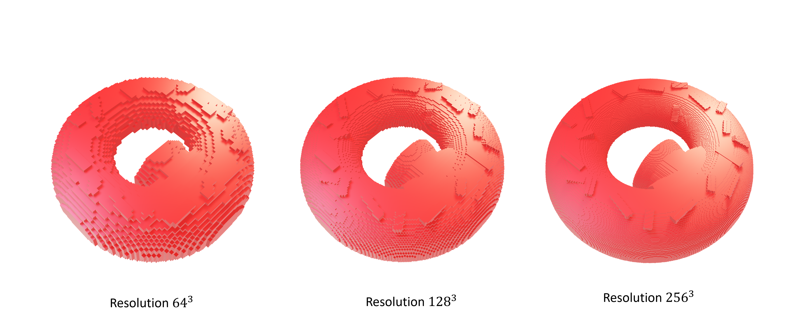
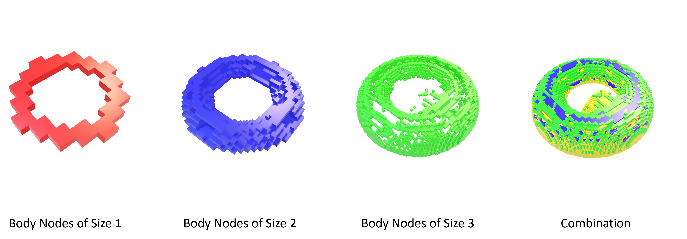
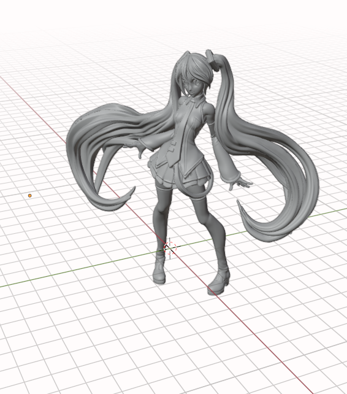
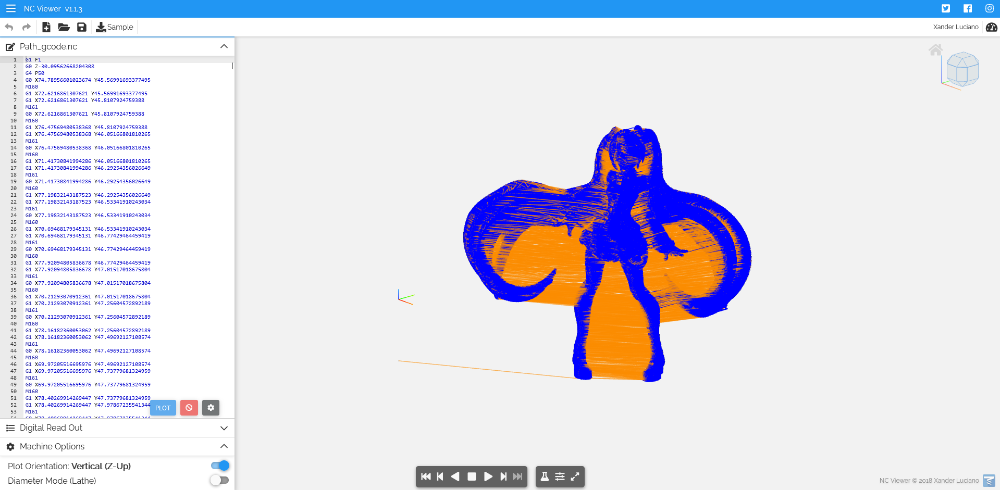

Requires: `Python 3.81`
This package requires CuPy. Please ensure CUDA Toolkit 12.3 is installed.
The Voxelization is run on GPU 3070 with 8GB, please be sure to use same GPU or GPU with more space, else, storage problem may occur.
The pic shows the obtained voxelized data of an STL 3D model generated by using blender and the resolution can be altered according to requirements. But resolution higher than 10 not recommended because storage may be exceeded. This package calculates not only the surface voxels but also the voxels inside the model for 3D printing and the size is adaptively changing. 


The path is hybrid path combined with zigzag and TSP, the g-code generated for the 3D model'Hatsune Miku' shown in NC viewer is in following. 




```bash
pip install -r requirements.txt
```

**User Guide:**

***Voxelization***
1. Open the [__init__.py] application.
2. Change the 'data_path' to your 'STL file' path
3. Click 'Run', this should generate voxelized and sliced data in the folder 'layer_data'

***Path planning and G-code***
you can go to the file [g_code_run.py] to change the feed rate in function 'g_code_create(folder_path=folder_path,feed_rate=1)'
1. Open the [g_code_run.py].
2. Ensure the 'Voxelization' has created data in folder 'layer_data'
3. Click 'Run', the G-code file 'Path_gcode.nc' should be found in 'layer_data' folder
